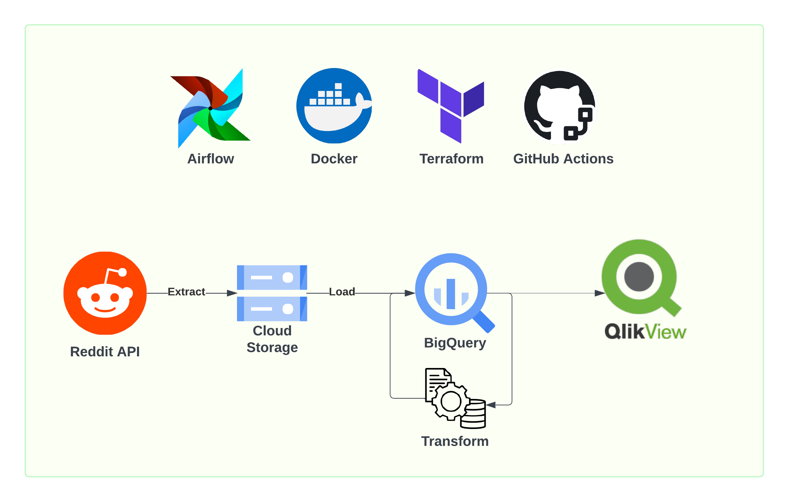

# ci-cd-for-data-engineering
The goal of this project is to create a data pipeline that extracts posts from the r/dataengineering subreddit. 

## Workflow
The data will be ingested daily to Google Cloud Storage. The next step is loading raw data into BigQuery where transformations will take place next. Finally, the enriched data will be ingested to QlikView to create a simple visualization. 
## Environment
1. The workflow will be orchestrated using Apache Airflow. 
2. The project will be containerized using Docker. 
3. The infrastructure will be managed using Terraform.  
4. Continuous Integration/Continuous Deployment (CI/CD) will be implemented using GitHub Actions to automate the deployment process. 